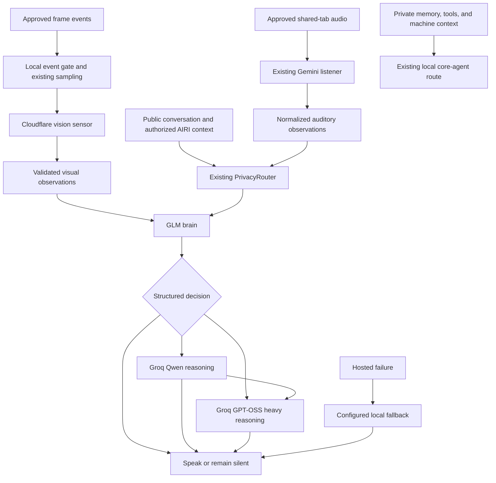

# Model roles for the hybrid desktop

Date: 2026-10-08

## Decision and existing architecture

The Windows hybrid profile now separates hosted hearing, vision, reactions, and reasoning.
The change extends the existing gateway and character orchestrator.
It does not replace the core-agent pipeline, character cards, memory stores, or speech pipeline.

The existing loopback gateway owns hosted credentials, destination checks, Gemini audio perception, local inference, and local speech.
`PrivacyRouter` separates public conversation history from private machine context and private history.
The character orchestrator schedules shared media reactions and controls consent, expiration, cooldowns, and cancellation.
`MediaAudioEars` supplies recent Gemini observations from an approved shared tab.
The extension supplies approved video frames and captions.
The watch ledger and private notebook retain their existing owners.

The existing design also has independent expression markers, animation markers, and Japanese speech extraction.
The new brain preserves those markers inside dialogue.
The reasoning tiers receive the same authorized context and character instructions.
They can return final dialogue without another GLM call.

## New architecture



The gateway exposes `brain/v1/chat/completions` and `media/brain/v1/chat/completions` through the existing authentication boundary.
The renderer continues to use the existing OpenAI-compatible provider definition.
The gateway replaces its `airi-brain` alias with the configured upstream model.
Only validated dialogue reaches the existing completion stream.
Provider JSON and provider errors never become character speech.

## Configuration

The ignored AIRI `.env` enables the roles and retains the external credential-file reference.
The external file remains unchanged.
No credentials moved into source files.
No commit was created.
The running desktop was not restarted during this change.

After you close the current desktop, start the hybrid launcher:

```powershell
powershell -NoProfile -ExecutionPolicy Bypass -File "F:\Nec Download\Airi\scripts\launch-hybrid.ps1"
```

The first enabled launch selects the `GLM` brain profile once.
It preserves session provenance and existing history.
Later launches preserve manual provider selections.
The `GLM` composer button selects the role pipeline.
Other existing buttons retain their direct provider routes.
When GLM is selected, shared media uses the configured vision sensor followed by GLM.

The full example is [`.env.hybrid.example`](../../../.env.hybrid.example).
The required hosted credentials are:

```dotenv
AIRI_KEYS_ENV="F:/Nec Download/SillyTavernSelfMod/.env"
CLOUDFLARE_ACCOUNT_ID=<32-character account ID>
CLOUDFLARE_AI_API_TOKEN=<Workers AI token>
CLOUDFLARE_AI_MODEL=@cf/zai-org/glm-4.7-flash
GROQ_API_KEY=<Groq key>
GEMINI_API_KEY=<existing Gemini key>
```

These credential values can remain in `AIRI_KEYS_ENV`.
The AIRI `.env` takes precedence for the new Cloudflare and Groq credentials.
Gemini retains its existing credential lookup.
`AIRI_GATEWAY_TOKEN` remains the existing local gateway credential.
Hosted credentials never become Vite variables.

| Role | Provider configuration | Model configuration | Default model |
| --- | --- | --- | --- |
| Hearing | Existing Gemini integration | `GEMINI_MODEL` | Existing Gemini model |
| Vision | `AIRI_VISION_PROVIDER` | `AIRI_VISION_MODEL` | `@cf/qwen/qwen3.8-27b` |
| Brain | `AIRI_BRAIN_PROVIDER` | `AIRI_BRAIN_MODEL` | `@cf/zai-org/glm-4.7-flash` |
| Reasoning | `AIRI_REASONING_PROVIDER` | `AIRI_REASONING_MODEL` | `qwen/qwen3.8-27b` |
| Heavy reasoning | `AIRI_HEAVY_REASONING_PROVIDER` | `AIRI_HEAVY_REASONING_MODEL` | `openai/gpt-oss-120b` |
| Local fallback | `AIRI_LOCAL_FALLBACK_PROVIDER` | `AIRI_LOCAL_FALLBACK_MODEL` | Existing `LOCAL_QWEN_MODEL` |

Cloudflare documents the [GLM model](https://developers.cloudflare.com/workers-ai/models/glm-4.7-flash/) and [Qwen vision model](https://developers.cloudflare.com/workers-ai/models/qwen3.8-27b/).
Its [OpenAI compatibility documentation](https://developers.cloudflare.com/workers-ai/configuration/open-ai-compatibility/) defines the account endpoint and busy rejection control.
Groq lists its models in the [model catalog](https://console.groq.com/docs/models).
The live catalog and completion checks confirmed both configured Groq identifiers.

To change a role, set its provider and model variables in the AIRI `.env`.
Then restart the hybrid launcher.
Supported provider names are `cloudflare`, `groq`, and existing gateway profile names.
The local fallback requires a private loopback profile.
Provider selection does not authorize private context for hosted inference.
The enabled configuration currently requires a valid Cloudflare account ID, even with provider overrides.

`AIRI_MODEL_ROLES_ENABLED=false` disables the role pipeline on the next launch.
The existing Gemini implementation and direct provider routes remain available.
The listener retains `AIRI_AUDIO_EARS`, its existing Gemini configuration, and sharing consent.
This implementation does not add an `AIRI_LISTENER_PROVIDER` variable.

`AIRI_PUBLIC_CHARACTER_PROMPT` supplies the character prompt for public brain requests.
An empty value retains the existing companion prompt.
Private character cards retain their existing local behavior.
The public prompt can express teasing, opinions, disagreement, and familiar dialogue without business-logic personality changes.
The launcher exposes this public prompt to the renderer.
It must contain only information intended for public hosted requests.

## Limits and context

| Role | Completion tokens | Attempt timeout | Ambient completion tokens |
| --- | ---: | ---: | ---: |
| GLM | 2048 | 12000 ms | 1024 |
| Vision | 1024 | 8000 ms | 1024 |
| Qwen | 4096 | 30000 ms | 4096 |
| GPT-OSS | 8192 | 45000 ms | 8192 |
| Local fallback | 2048 | 15000 ms | 2048 |

Each role accepts `_MAX_TOKENS`, `_AMBIENT_MAX_TOKENS`, `_TIMEOUT_MS`, `_REASONING_EFFORT`, and `_THINKING` after its configuration prefix.
For example, `AIRI_BRAIN_AMBIENT_MAX_TOKENS=512` reduces the ambient completion budget.
Provider support determines the effect of reasoning controls.
The applied configuration uses medium Qwen effort and high GPT-OSS effort.
Groq documents supported effort values in its [reasoning guide](https://console.groq.com/docs/reasoning).

`AIRI_BRAIN_THINKING=false` disables GLM thinking through the Workers AI chat template.
The router uses native JSON schema for Cloudflare and JSON object mode for Groq.
Local validation still checks every decision and observation.
Prompt-only GLM output failed the first live check, so native grammar enforcement is part of this implementation.

`AIRI_CONTEXT_MESSAGES` defaults to 12 recent messages, plus the opening instruction.
The public history projection also retains at most 12 recent turns.
Private history, private memories, and unclassified machine context never enter that projection.
Media context retains existing bounded captions, recent auditory observations, and approved habit projections.
The text brain receives normalized vision observations instead of raw frames.

## Decisions, silence, and escalation

The brain returns `speak`, `silent`, or `escalate`, with dialogue and an optional escalation reason.
Expression and animation cues use existing AIRI markers inside dialogue.
The bilingual profile uses separate Japanese dialogue and English translation fields.
The gateway assembles the existing display format after validation.
Japanese speech extraction continues to exclude the translation.

Ordinary conversation makes one GLM call.
An escalation needs a nonempty reason and level 1 or 2.
Level 1 selects Qwen.
Level 2 selects GPT-OSS when enabled.
Qwen can explicitly request level 2.
Each tier receives the original bounded context, rather than only a GLM summary.
No tier executes more than once during a request.
`AIRI_HEAVY_REASONING_ENABLED=false` removes the heavy tier.

The deterministic gate drops named mouse, cursor, resize, DOM mutation, and heartbeat events.
It also drops unchanged extension evidence before the existing scheduler calls a model.
New audio evidence can reopen the gate.
Scope changes clear the gate state.
The gateway suppresses identical ambient requests during an active request and for 60 seconds after completion.
Validated visual observations remain cached for identical frame sets for 60 seconds.
Both gateway caches retain at most eight entries.

The existing extension sampling interval, sharing consent, reaction cooldown, and expiration still apply.
The VLM runs only when approved frames reach the media route.
Silence produces an empty completion and no dialogue.
The brain prompt requests selective attention and discourages routine app narration.
The cheap gate handles trivial events before hosted inference.

## Failure behavior and observability

Vision failure removes visual evidence and continues with authorized text.
Missing hearing does not prevent text conversation.
GLM failure tries Qwen once, then the configured local fallback.
An explicit reasoning-tier failure tries the local fallback.
An outage alone never selects GPT-OSS.
An exhausted chain or malformed decision produces silence.
Cancellation prevents further escalation or fallback calls.

HTTP 401, 403, and 429 create a cooldown shared by roles with the same account endpoint and credential.
HTTP 429 backs off for at least 60 seconds and respects a longer `Retry-After` value.
Other upstream failures create a model cooldown of at least 15 seconds.
The router performs no immediate retry loop.
Cloudflare requests use `rejectIfBusy`.

Logs report received and discarded events, requested roles, actions, escalation, fallback, status, rate limits, and latency.
Normal role logs contain no credentials, audio transcripts, screenshots, or dialogue.

## Files changed for this task

The checkout contains earlier hybrid work and concurrent changes.
This list describes only the role migration.

| Files | Change |
| --- | --- |
| `packages/stage-ui/src/libs/model-role-profile.ts` | Shared gateway profile and destination checks |
| `packages/stage-ui/src/libs/model-roles.ts` | Vision normalization, structured decisions, escalation, cooldowns, and fallback |
| `packages/stage-ui/src/libs/sensory-context.ts` | Auditory normalization and deterministic event gate |
| `packages/stage-ui/src/libs/model-roles.test.ts` | Routing, silence, vision, deduplication, failure, parsing, and marker tests |
| `packages/stage-ui/src/libs/privacy-routing.ts` and its test | Public brain prompt, bounded public history, normalized auditory context |
| `packages/stage-ui/src/libs/media-audio.ts` | Import spacing required by repository lint |
| `packages/stage-ui/src/stores/privacy-routing.ts` | Brain selection and public prompt configuration |
| `packages/stage-ui/src/stores/media-watch-memory.ts` | Brain as an approved habit-reaction provider |
| `packages/stage-ui/src/stores/character/orchestrator/store.ts` and `media-scheduling.test.ts` | Event gate and brain media scheduling |
| `apps/stage-tamagotchi/src/renderer/components/hybrid-provider-picker.vue` | GLM profile selection |
| `apps/stage-tamagotchi/src/renderer/components/hybrid-memory-controls.vue` | GLM habit-reaction selection |
| `apps/stage-tamagotchi/scripts/hybrid/model-role-config.ts` and its test | Independent role configuration |
| `apps/stage-tamagotchi/scripts/hybrid/gateway.ts` and its test | Brain endpoints, compatible completion stream, normalized hearing metadata |
| `apps/stage-tamagotchi/src/renderer/modules/hybrid.ts` and `hybrid.browser.test.ts` | One-time default migration with provenance preservation |
| `scripts/launch-hybrid.ps1` | Safe public Vite variables |
| `.env.hybrid.example` and ignored `.env` | Role configuration and external credential reference |
| `docs/ai/adr/multi-model-brain.md` | Architecture, configuration, results, and limitations |

## Tests and results

The commands used portable Node and pnpm from `.local`.
The test processes used the existing local Playwright browser installation.
The scheduler check used synthetic gateway credentials.

```powershell
pnpm -F @proj-airi/stage-ui exec vitest run src/libs/model-roles.test.ts src/libs/privacy-routing.test.ts src/libs/media-audio.test.ts src/libs/media-vision.test.ts src/stores/media-watch-memory.test.ts src/stores/ai/chat-llm/llm.hybrid.test.ts src/stores/character/orchestrator/index.test.ts src/stores/character/orchestrator/media-scheduling.test.ts
pnpm -F @proj-airi/stage-tamagotchi exec vitest run --config vitest.node.config.ts scripts/hybrid/gateway.test.ts scripts/hybrid/model-role-config.test.ts
pnpm -F @proj-airi/stage-tamagotchi exec vitest run --project browser src/renderer/modules/hybrid.browser.test.ts
pnpm -F @proj-airi/stage-ui exec vitest run src/stores/character/orchestrator/media-scheduling.test.ts
pnpm -F @proj-airi/stage-ui typecheck
pnpm -F @proj-airi/stage-tamagotchi typecheck
pnpm typecheck
pnpm lint
```

The shared suite checks ordinary GLM routing, explicit Qwen and GPT-OSS escalation, silence, malformed output, and cancellation.
It also checks vision normalization, frame reuse, account cooldowns, local fallback, and text operation without Gemini.
Privacy tests check the configured public character prompt and private provenance.
Gateway tests check sensor-to-brain requests through real loopback HTTP and compatible SSE output.
Browser tests check one-time default selection and later manual selections.
The enabled scheduler check covers GLM media routing and the existing independent video-provider route.

| Command | Result |
| --- | --- |
| Targeted shared tests, eight files | 92 passed, 5 skipped because the hybrid environment was disabled |
| Gateway and role configuration tests | 37 passed |
| Browser migration tests | 3 passed |
| Scheduler tests with the hybrid environment enabled | 7 passed |
| `pnpm -F @proj-airi/stage-ui typecheck` | Passed |
| `pnpm -F @proj-airi/stage-tamagotchi typecheck` | Passed |
| `pnpm typecheck` | Blocked by missing `vue-tsc` in `@proj-airi/scenarios-stage-tamagotchi-browser`, exit 127 |
| `pnpm lint` | Passed, 0 errors and 676 warnings |

The root typecheck did not complete.
The affected workspace typechecks completed independently.
The first root lint check found an import spacing error in the shared audio module.
The import spacing now follows the repository rule.
An initial browser run lacked the Playwright browser path.
The browser check passed after the process used `.local/playwright-browsers`.
An initial enabled scheduler run lacked synthetic gateway configuration.
The scheduler check passed with the complete hybrid test environment.

The live smoke check used a synthetic greeting and a generated red rectangle image.
It did not send personal screen or audio data.
The gateway ran on an ephemeral loopback port and closed after the check.

| Live check | Result | Observed latency |
| --- | --- | ---: |
| GLM through the brain gateway | HTTP 200, validated Japanese dialogue and English translation | 3.67 seconds |
| Cloudflare vision sensor | HTTP 200, valid structured rectangle observation | 4.97 seconds |
| Vision followed by GLM through the media gateway | HTTP 200, validated dialogue without raw JSON | 10.96 seconds total |
| Groq Qwen | HTTP 200, structured response | 1.21 seconds |
| Groq GPT-OSS | HTTP 200, structured response | 2.34 seconds |

These measurements describe one synthetic run.
They do not establish a latency guarantee or personality quality.

## Limitations and next improvements

The migration covers the Windows hybrid profile and approved public context.
Generic microphone input, private desktop observations, and private memories retain the existing local privacy route.
Gemini normalization currently covers approved shared-tab audio.
It preserves reliable existing labels and does not invent speaker, tone, confidence, or transcription fields.

Hosted brain decisions cannot execute private computer tools or write the private notebook.
Those actions remain in the existing local core-agent pipeline.
The decision schema intentionally excludes duplicate tool and memory concepts.
A future hosted tool policy needs explicit safe tools, bounded results, and provenance checks.
This change does not implement that broader authorization policy.

Screenshot deduplication uses exact frame equality.
It does not compare perceptual similarity.
The live GLM check spoke about the plain rectangle despite the sensor marking it uninteresting.
Silence and trivial-event tests passed, but selective personality behavior still needs representative scene evaluation and prompt tuning.

Completion output buffers until the structured decision is valid.
The existing 20-second ambient deadline can cancel a slow escalation before its configured upstream timeout.
Direct conversation can use the longer reasoning timeout.
The local fallback uses the existing configured model and requires valid JSON output.
No local model was installed or replaced.
Real offline fallback quality was not evaluated.

The next improvements are perceptual frame deduplication, representative silence evaluations, and richer listener metadata when supported.
An explicit public character editor can expose the current environment prompt through the existing card workflow.
Safe hosted tool decisions require a separate policy change.
Local fallback evaluation can use Qwen3.5-9B through the existing loopback configuration.
